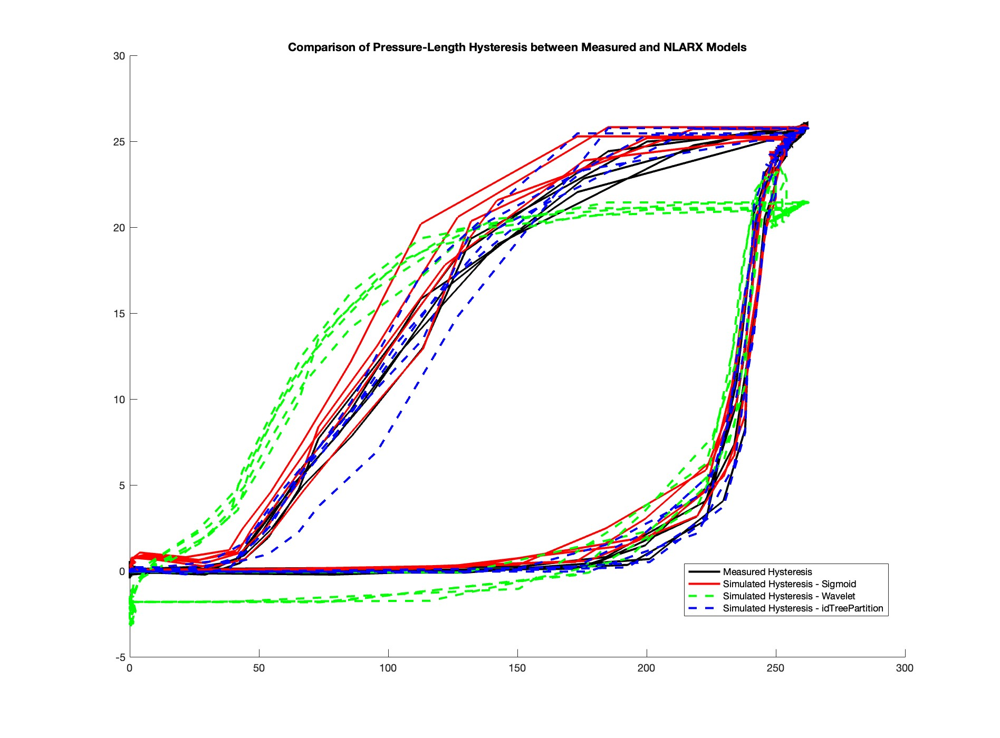

# Technical Report #1 - Nonlinear System ID & State Estimation
## Overview & Data Disclaimer
This report evaluates a standalone GNC framework for nonlinear pneumatic actuators.
* Technical Analysis: All figures and metrics (e.g. the 98.2% Fitness) are derived from a high fidelity 10,000 sample research dataset.
* Demonstration Data: The provided data.mat is a **synthetic placeholder**. It ensures that the implementation scripts will run, but it does not match or replicates the specific benchmarks shown in this report. 
* **Licensing**: The technical analysis, figures, and documentation in this report are licensed under **CC BY-NC-ND 4.0**. The implementation code is licensed under **MIT**.
* Research Integrity: The full datasets remains under embargo pending publication in ***IEEE T-RO***, ***IJRR***, and ***Data in Brief***.

---

## **1. Model Identification: NLARX Architectures**
The plant was modeled using three distinct Nonlinear ARX (NLARX) models to map pressure-length dynamics.

* **Performance (Figure 1)**: Initial time-series estimation across the three models shows a strong general match, proving the NLARX framework's fundamental viability. 
<figure>
  
  <figcaption align="center"><b>Figure 1:</b> Performance comparison between NLARX Models  during hysteretic loading and complex nonlinear behaviors.</figcaption>
</figure>

* **Hysteresis Matching (Figure 2)**: `Sigmoid` (98.2%) and `idTreePartition` (98.4%) achieved the best fitness for large-scale hysteresis loops. Wavelet (76.2%) is kept as a secondary specialist for transient behavior at this stage. 
<figure>
  
  <figcaption align="center"><b>Figure 2:</b> Performance comparison between NLARX Models  during hysteretic loading and unloading. Noting that Sigmoid - red and idTreePartition - Dashed Blue closely follows the Measured Hysteresis trends.</figcaption>
</figure>

* **Decision**: Sigmoid is the primary choice for the controller. While Tree Partitioning is accurate, the Sigmoid network provides the continuous, smooth gradients required for optimization. 

---

## **2. Jacobian Sensitivity & The Linearization Trap**
Before selecting an estimator, a **Jacobian Proxy** analysis was performed to evaluate the numerical stability of derivative-based filters. 

* **Evidence (Figure 3)**: Gradient analysis revealed massive, non-differentiable spikes (ranging from **+400 to -1100**) during pressure transitions.
<figure>
  
  <figcaption align="center"><b>Figure 3:</b> Jacobian Gradient by Proxy showing that gradient spikes emerges massively across all three distinct NLARX Models. </figcaption>
</figure>

* **Decision**: These spikes indicate that an Extended Kalman Filter (EKF) will be chronically ill-defined or ill-conditioned. To avoid this "Linearization Trap," the analytsis moved toward derivative-free sampling methods like the **UKF** primarily. 

---

## **3. Estimator Benchmark: The State Estimation Duel**
Three Kalman variants (EKF, UKF, CKF) were benchmarked against measured length data to determine the most robust tracker.

* **The Bias Problem (Figure 4)**: Both the EKF and Cubature Kalman Filter (CKF) failed to resolve hysteresis-induced offsets, resulting in a persistent **-7.5 mm tracking bias**. <figure>
  
  <figcaption align="center"><b>Figure 4:</b> Time-series comparison between three NLARX Models plant fed into each Kalman Filter. From Top to Bottom: Sigmoid | Wavelet | idTreePartition</figcaption>
</figure>

* **The Winner**: The **Unscented Kalman Filter (UKF)** successfully eliminated this bias across both Sigmoid and Wavelet models, leveraging the Unscented Transform to remain robust on steep manifold slopes where linearization fails.
* **Model Elimination**: Despite its high training fitness, the "steppy" nature of the `idTreePartition` model led to severe ill-conditioning during filter execution; it was eliminated at this stage. 
* *Special Note* - It is worth referencing that the Wavelet model feeding into UKF did somewhat keep up with the Measured Data and has been noted as a secondary portion of analysis if needed. 

---

## **Conclusion: Final Architecture Selection**

*<b>Figure 5:</b> Time-series comparison between three NLARX Models plant fed into each Kalman Filter. From Top to Bottom: Sigmoid | Wavelet | idTreePartition*

**Figure 5** illustrates the final comparison: despite the inherent difficulty in tracking raw hysteresis, the **Sigmoid NLARX + UKF** combination emerged as the most stable architecture. It provides the necessary gradient smoothness for the filter while rejecting the biases that crippled standard industry estimators. It is however worth noting that if Pressure-Length Hysteresis were to be the desired target instead of RMSE fit, the Sigmoid NLARX + EKF and the Wavelet NLARX + UKF should be added as a secondary focus if time permits for extension. 

**Selected Model for Reports #2 (Monte Carlo) and #3 (MPC):**
* **Plant Model**: Sigmoid-based NLARX.
* **State Estimator**: Unscented Kalman Filter (UKF).

 

