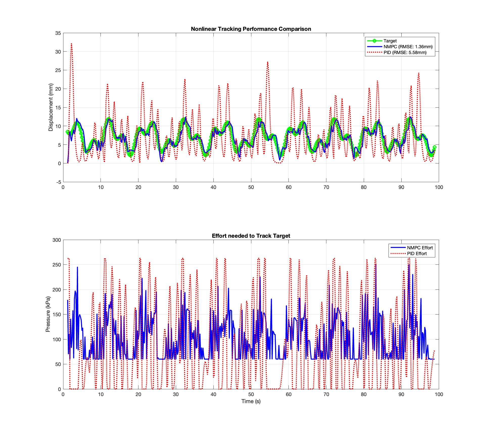

# **Technical Report #3 - Nonlinear Model Predictive Control (NMPC)**

## **Overview & Data Disclaimer**
This report evaluates the final control layer of the framework: a **Nonlinear MPC** designed to track displacement targets in high-hysteresis pneumatic actuators. 

* **Technical Analysis**: All figures and tracking metrics are derived from the validated research plant model.
* **Licensing**: Documentation, visuals (Figures), and analysis are licensed under **CC BY-NC-ND 4.0**.
* **Research Integrity**: Controller optimization scripts remain under embargo pending formal publication in ***IEEE T-RO***, ***IJRR***, and ***Data in Brief***. 

---

## **1. Tracking & Control Performance: NMPC vs. Baseline PID**
While standard industrial controllers like PID are computationally efficient, they are fundamentally ill-conditioned for plants with the non-differentiable gradients and saturation-induced hysteresis identified in Report #1.

*Figure 1: Tracking performance comparison. The NMPC (Blue) achieves an RMSE of <b>1.36 mm</b>, while the PID (Red Dotted) suffers from massive oscillations and a significantly higher RMSE of <b>5.58 mm</b> due to unmodeled hysteretic transitions.*
  
* **Model-Based Advantage**: By leveraging the Sigmoid-NLARX plant model, the NMPC anticipates hysteretic transitions, resulting in the smooth, high-fidelity tracking shown in the top subplot. 
* **Effort Optimization**: The bottom subplot compares the control effort (Pressure). The NMPC maintains stable, purposeful pressure modulation within the 50–250 kPa saturation limits, whereas the PID effort is erratic and numerically inefficient. 

---

## **Conclusion: Framework Validation**
The transition from a linearized PID baseline to a Nonlinear MPC resulted in a **75.6% reduction in tracking error**. This validates the quasi-GNC pipeline analysis:
1. SysID: Identifying the non-differentiable Jacobian spikes.
2. Estimation: Utilizing the UKF to reject the -7.5 mm Bias. 
3. Control: Leveraging Sigmoid-NLARX smoothness for stable NMPC optimization

---
**Final Architecture Status:**
* **Plant Model**: Sigmoid-based NLARX (Validated)
* **State Estimator**: Unscented Kalman Filter (Validated)
* **Controller**: Nonlinear MPC (Validated)
